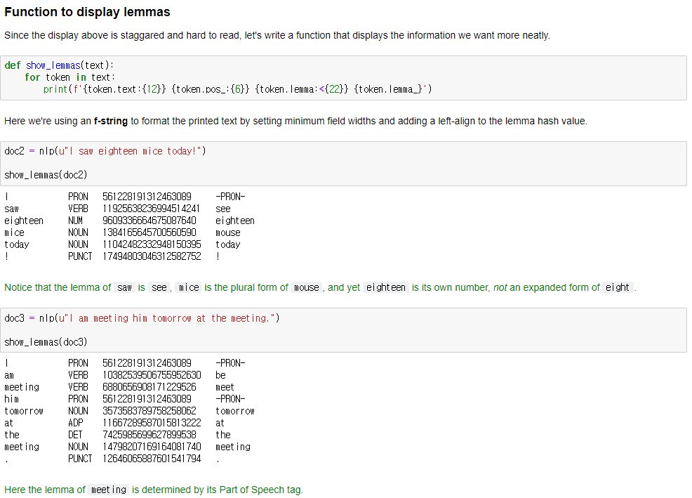
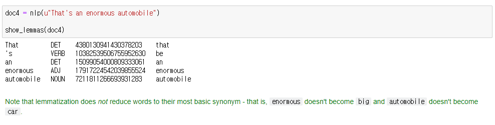

# Lemmatization

it is more close to 'Morphological Analysis'

lemmatization is typically seen as much more informative than simple stemming.

thats why Spacy has opted only lemmatization instaed of Stmming

it finds it's original form or meaning based on its own context.

but it doesn't reduce words to most basic synonym..